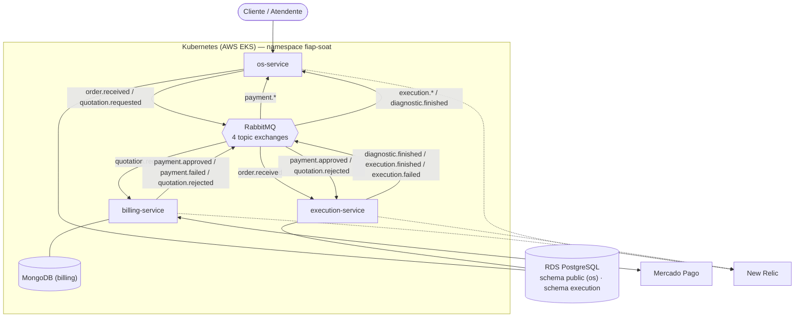

# FIAP SOAT — Tech Challenge Fase 4
## Sistema de Ordens de Serviço da Oficina Mecânica (Microsserviços)

---

## 1. Participantes

| Nome | RM | E-mail |
|---|---|---|
| _(preencher)_ | _(RM)_ | _(e-mail)_ |
| _(preencher)_ | _(RM)_ | _(e-mail)_ |

> **Ação:** preencher nomes/RM do grupo antes de gerar o PDF.

---

## 2. Links dos repositórios

| Microsserviço | Repositório |
|---|---|
| OS Service | https://github.com/zmathmatos/fiap-soat-os-service |
| Billing Service | https://github.com/zmathmatos/fiap-soat-billing-service |
| Execution Service | https://github.com/zmathmatos/fiap-soat-execution-service |
| Infraestrutura (EKS + RDS + RabbitMQ + Mongo) | https://github.com/zmathmatos/fiap-soat-tech-challenge-infra-db |
| Lambda de autenticação (CPF) | https://github.com/zmathmatos/fiap-soat-tech-challenge-lambda |

---

## 3. Vídeo de demonstração

**Link (YouTube/Vimeo, ≤15 min, público ou não listado):** _(preencher)_

Conteúdo demonstrado: fluxo completo de uma OS pelos 3 microsserviços, execução do Saga Pattern e compensação em falha, deploy automatizado com validação de testes, e monitoramento/rastreamento distribuído (New Relic).

---

## 4. Diagrama geral da arquitetura

Arquivo-fonte: [`arquitetura-geral.mmd`](arquitetura-geral.mmd)

**Bancos de dados (requisito SQL + NoSQL):**

| Serviço | Banco | Isolamento |
|---|---|---|
| os-service | PostgreSQL (RDS) — schema `public` | role `os_svc` (GRANT só neste schema) |
| execution-service | PostgreSQL (RDS) — schema `execution` | role `execution_svc` (GRANT só neste schema) |
| billing-service | MongoDB — database `billing` | usuário `billing` com `readWrite` só neste db |

Nenhum serviço acessa o banco de outro — imposto por **permissões do PostgreSQL** (`REVOKE ... FROM PUBLIC` + `GRANT` restrito por schema/role) e por usuário dedicado no MongoDB, e não por convenção.

---

## 5. Estratégia do Saga Pattern: **Coreografia (Choreography)**

Escolhemos **saga coreografada**: não há orquestrador central. Cada serviço **publica os eventos das etapas que ele executa** e **reage** aos eventos dos outros para dar continuidade ao fluxo. Cada _topic exchange_ pertence ao seu publicador (`service-order-events` → os, `quotation-events` → os, `payment-events` → billing, `execution-events` → execution).

**Fluxo feliz:**
1. Abertura da OS (os-service) → publica `order.received` → execution enfileira para diagnóstico.
2. Diagnóstico registrado (execution) → publica `diagnostic.finished` → os-service muda OS para "Aguardando aprovação" → publica `quotation.requested`.
3. billing consome `quotation.requested` → gera orçamento e envia por e-mail.
4. Cliente aprova → billing cria preferência no Mercado Pago; pagamento confirmado (webhook) → publica `payment.approved` → os-service move OS para "Em execução" e execution inicia o reparo.
5. Reparo finalizado (execution) → publica `execution.finished` → os-service conclui a OS ("Finalizado").

**Rollback / compensação (falhas):**
- **Orçamento rejeitado** → billing publica `quotation.rejected` → os/execution encerram/cancelam a OS.
- **Pagamento recusado/cancelado** → billing publica `payment.failed` → os move OS para "Finalizado" e execution cancela a execução.
- Entrega **atômica** dos eventos via **outbox** (persistência do estado + evento na mesma transação) e **idempotência** por `messageId`/`serviceOrderId` nos consumidores, garantindo _at-least-once_ sem duplicar efeitos.

**Por que coreografia (e não orquestração):** o fluxo tem poucos passos e baixo acoplamento; evita um ponto único de coordenação/falha, mantém cada serviço autônomo e escala melhor sob o cenário de múltiplas filiais. O custo (visibilidade do fluxo distribuído) é mitigado pelo **tracing distribuído no New Relic**.

---

## 6. Justificativa da divisão dos microsserviços e tecnologias

**Divisão por _bounded context_ (DDD):**
- **os-service** — ciclo de vida da OS e cadastros (usuários, veículos, peças, serviços). É o "dono" do status da OS.
- **billing-service** — orçamento e pagamento (integração Mercado Pago). Isolado por lidar com dinheiro e um provedor externo, com modelo de dados documental (payload de pagamento variável → NoSQL).
- **execution-service** — filas FIFO de diagnóstico e execução do reparo. Isolado pela regra de ordenação estrita (fila) e cadência própria de trabalho da oficina.

**Tecnologias:**
| Área | Escolha | Motivo |
|---|---|---|
| Runtime | Node.js 22 + TypeScript | Produtividade, tipagem, ecossistema |
| Arquitetura | Clean Architecture (4 camadas) | Testabilidade, dependências apontando para o domínio |
| SQL | PostgreSQL (os, execution) | Dados relacionais e transacionais (OS, filas) |
| NoSQL | MongoDB (billing) | Payload de pagamento flexível/semiestruturado |
| Mensageria | RabbitMQ (topic exchanges) | Integração assíncrona desacoplada da saga |
| Pagamento | Mercado Pago | Requisito do desafio |
| Orquestração | Kubernetes (AWS EKS) + HPA | Deploy automatizado e escala horizontal |
| CI/CD | GitHub Actions → ECR → EKS | Pipeline independente por serviço |
| Qualidade | SonarCloud + cobertura ≥80% | Verificação automática no CI |
| Observabilidade | New Relic (APM + tracing distribuído) | Rastreamento dos fluxos distribuídos |

---

## 7. Testes e qualidade (evidências)

- **Testes unitários** em todos os serviços; **cobertura mínima de 80%** enforced no CI (Jest + SonarCloud).
- **BDD (Cucumber)** cobrindo fluxo completo + compensação da saga em: os-service (`features/os-flow.feature`), billing-service (`features/billing-flow.feature`) e execution-service (`features/execution-flow.feature`).
- **SonarCloud** por repositório (Quality Gate + cobertura) — badges no topo de cada README.
- **CI/CD independente** por serviço (build → testes → Sonar → deploy EKS) e **branch `main` protegida** com PR obrigatório e checagens.

---

## 8. Nota de arquitetura — banco único com isolamento lógico

Por limite de crédito do **AWS Academy**, os serviços SQL compartilham **uma instância RDS** com **isolamento por schema + role** (em vez de uma instância por serviço). O isolamento de **acesso** exigido pelo desafio está garantido por permissões do PostgreSQL. A migração para instâncias dedicadas não exige mudança de código — apenas de _connection string_. Detalhes no README do `fiap-soat-tech-challenge-infra-db`.
